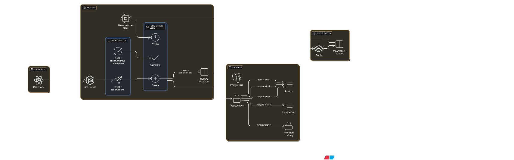

# ARCHITECTURE.md

## System Architecture Overview

This Flash Sale Stock Reservation System is built using NestJS for the backend with PostgreSQL as the database, BullMQ (Redis-based) for background job processing and ReactJs for the frontend.

---

## How Expiration Works



### Job Queue Architecture

The system uses **BullMQ** with Redis to handle reservation expiration asynchronously:

1. **Reservation Creation Flow:**

   - When a reservation is created via `POST /reservations`, the system:
     - Creates a reservation record with status `Active`
     - Sets `expiredAt` timestamp to 2 minutes from creation
     - Immediately deducts stock from the product
     - Enqueues a delayed job in BullMQ with a 2-minute delay

2. **Background Worker:**

   - `ReservationWorker` processes jobs from the `reservation-expire` queue
   - The worker executes exactly 2 minutes after the reservation is created
   - Worker calls `expireReservation()` which:
     - Checks if reservation is still `Active`
     - Updates status to `Expired`
     - Restores the reserved quantity back to product stock
     - Uses database transactions to ensure atomicity

3. **Persistence Guarantee:**
   - Jobs are stored in Redis, not in application memory
   - If the server restarts, BullMQ automatically recovers pending jobs
   - Expiration will still occur even after server crashes or deployments

---

## How Concurrency is Handled

### Row-Level Locking with `FOR UPDATE`

The system prevents race conditions and ensures data consistency using PostgreSQL's **row-level locking**:

#### 1. **Creating Reservations:**

```sql
SELECT * FROM "Product" WHERE id = ${productId} FOR UPDATE
```

- Acquires an exclusive lock on the product row
- Prevents other transactions from reading/modifying the same product
- Ensures stock checks and deductions are atomic
- Other concurrent reservation attempts wait until the lock is released

#### 2. **Completing Purchases:**

```sql
SELECT * FROM "Reservation" WHERE id = ${id} FOR UPDATE
```

- Locks the reservation row before status update
- Prevents double-completion if user clicks multiple times
- Prevents completion if expiration worker is processing the same reservation

#### 3. **Expiring Reservations:**

```sql
SELECT * FROM "Reservation" WHERE id = ${id} FOR UPDATE
```

- Locks reservation before checking status
- Ensures expired reservations don't get completed
- Prevents race condition between completion and expiration

### Transaction Isolation

All critical operations are wrapped in database transactions (`$transaction`):

- **Atomicity:** All operations succeed or all fail together
- **Consistency:** Stock levels are always accurate
- **Isolation:** Concurrent operations don't interfere with each other
- **Durability:** Changes are persisted immediately

## Database Schema

### Products Table

```typescript
model Product {
  id              Int      @id @default(autoincrement())
  name            String
  price           Float
  available_stock Int
  reservations    Reservation[]
  createdAt       DateTime @default(now())
  updatedAt       DateTime @updatedAt
}
```

**Key Points:**

- `available_stock` represents real-time available inventory
- Stock is immediately deducted on reservation creation
- Stock is restored on expiration or if purchase fails

### Reservations Table

```typescript
model Reservation {
  id         Int                @id @default(autoincrement())
  product_id Int
  status     ReservationStatus  @default(Active)
  quantity   Int
  product    Product            @relation(fields: [product_id], references: [id])
  createdAt  DateTime           @default(now())
  expiredAt  DateTime
}

enum ReservationStatus {
  Active
  Expired
  Completed
}
```

---

## Trade-offs and Limitations

### ⚠️ Trade-offs

1. **Redis Dependency:**

   - **Limitation:** System requires Redis to be running
   - **Impact:** Additional infrastructure complexity

2. **Database Lock Contention:**

   - **Limitation:** High concurrency on same product can cause lock waits
   - **Impact:** Slower response times during flash sales

3. **No Reservation Cancellation:**

   - **Limitation:** Users cannot manually cancel reservations
   - **Impact:** Stock remains locked for full 2 minutes

4. **Fixed Expiration Time:**

   - **Limitation:** 2-minute expiration is hardcoded
   - **Impact:** Not flexible for different product types

---

## System Requirements

- **Database:** PostgreSQL 12+
- **Queue System:** Redis 6+
- **Runtime:** Node.js 20.19.0+
- **Framework:** NestJS 10+, ReactJs 18+

---
